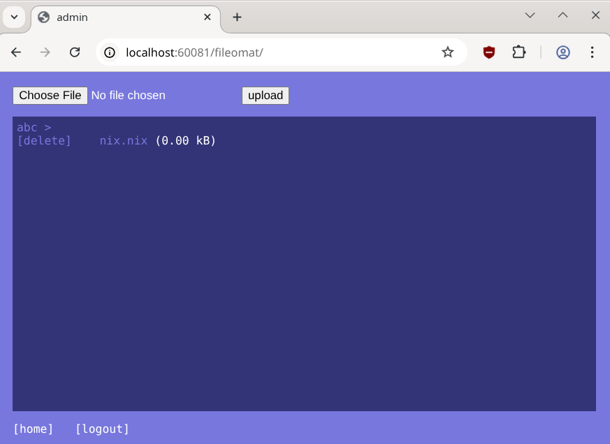

# Fileomat

Fileomat is a simple system to share files online. Simple `WWW-Authenticate` is used!

## Features WebGUI

- Normal User
  - Login
  - browse folders
  - see file size
  - download
- Admin User
  - upload files
  - delete files

## Features Backend

- config file to handle
  - base url
  - name of the log file
  - name of the style- and template file
  - byte limit for upload
  - foldername for file storage
  - BAN LIST
    - max number of fails to ban an ip (`max_failed` 8)
    - how many minutes the ip will ban (`block_duration` 30m)
    - the period to check and remove ip from ban list (`check_duration` 5m)
- a simple html template
- inside `main.go` 3 template strings to format the file-lines
- sanatize filename: only small letters, numbers and a single . for file extension is allowed

## ToDo

- goDoc
- examples and unit tests
- build and test via CI/CD
- User management: better password configuration
- clean code for handling folder, not allowed paths and file requests (actual a bit chaotic)

## Missing (for ever)

- create/delete folders as admin via WebGUI
- display static images

## User management

It is hacky! Run `go run . secretpassword` to get a hash for the `secretpassword`.
Use this hash in `main.go` to set a password or add a user.

See `etc/config.json` which username is the `admin_user`.

Default user: tux, password tux
Default user: admin, password toor

# License

It is under http://unlicense.org